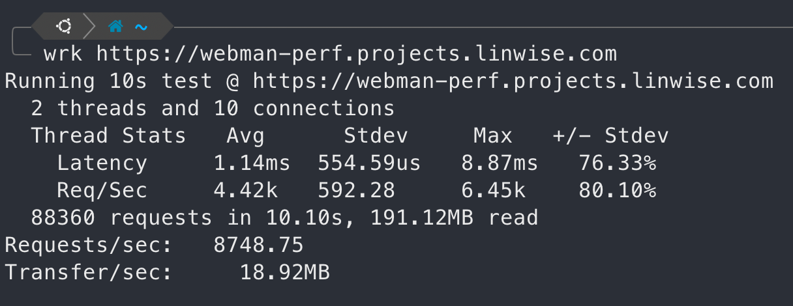
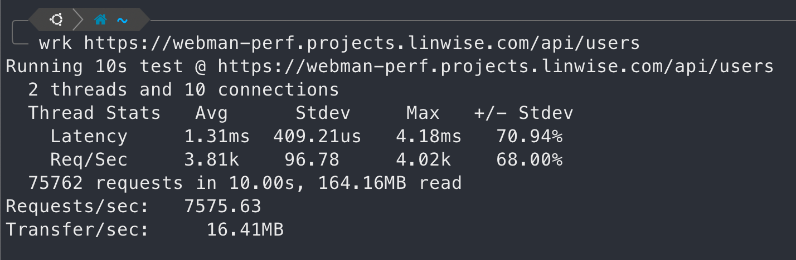

# Simple Webman Performance Test

> webman: https://www.workerman.net/webman
>
> App running on 4c8g 20hdd AWS EC2 VPS.
>
> PostgresSQL 16.8 db.
>
> Requests are sent from the same server.

I deployed https://github.com/shrekuu/laravel-perf app first.

Then I deployed this app and this `/api/users` read data from laravel-perf app db.

## Sceenshots

### get landing page, 8700+ rps

## get users with redis cache, 7500+ rps

<h1>LICENSE</h1>
The webman is open-sourced software licensed under the MIT.

